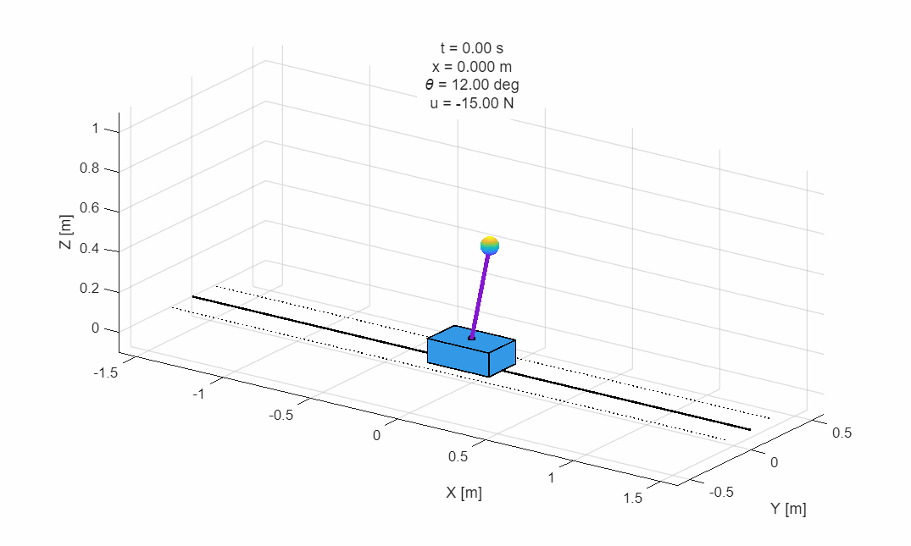

# Linear and Nonlinear MPC for the Cart-Pole System



## Overview
A MATLAB-based simulation and evaluation suite designed to test and compare Linear and Nonlinear Model Predictive Control (MPC) strategies on the **upright stabilization** of the classic Inverted Pendulum (Cart-Pole) system, with emphasis on:

- constrained stabilization,
- real-time feasibility,
- horizon and sampling-time design choices,
- robustness under external disturbances.

Focus is made on the distinction between *stabilizability* (whether the controller keeps the pendulum upright under constraints) and *deployability* (whether it does so while respecting solver-time requirements).

## Features
- **Controllers**:
  - Linear MPC (`linear_mpc`): uses a linearized model around the upright equilibrium and solves a constrained quadratic program.
  - Nonlinear MPC (`nmpc`): uses the nonlinear plant model directly and solves a nonlinear program using *CasADi/IPOPT*.
- **Plant Dynamics**: 
  Full nonlinear tracking via 4th-order Runge Kutta (RK4) integration is performed on the controlled cart–inverted pendulum in upright regulation mode.

  State:
$$x = [p, \dot{p}, \theta, \dot{\theta}]^\top$$
  where:
  - $p$ = cart position
  - $v = \dot{p}$ = cart velocity
  - $\theta$ = pendulum angle from the upright equilibrium
  - $\omega = \dot{\theta}$ = angular velocity

  Control input:
  - $u$ = horizontal force applied to the cart

  Typical constraints include:
  - input magnitude limit
  - input-rate limit
  - cart displacement limit
  - pendulum-angle regulation envelope

- **Experimental Suite**: 
  - Automated scripts to perform horizon sweeping, tuning sweeping, and robustness evaluation against disturbance tests.

## Prerequisites
- **MATLAB** (R2024a or newer)
- **[CasADi](https://web.casadi.org/)**: Required for the CasADi-based NMPC backend.

## Repository Structure
```
LN_MPC_Cart-Pole_Benchmark/
├── casadi_nmpc/   # CasADi setup, initialization, and step functions for NMPC
├── controllers/   # Unified controller initialization and step wrappers
├── experiments/   # Experimental suite (configuration, run scripts, plotting)
├── model/         # Cart-pole parameter definitions, linearizations, and nonlinear dynamics
├── mpc/           # General MPC subroutines and constraints building
└── README.md    
Modiffication can be made in `experiments/default_config.m` to modify and evaluate custom controller setups.

